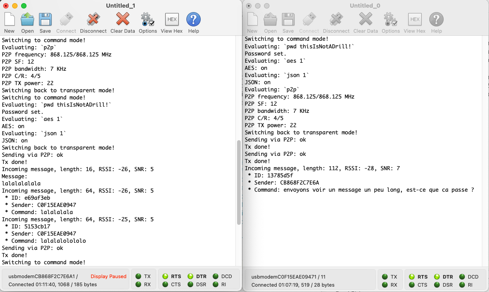

# RUI3_LoRa_Companion

This a companion (pun intended) project for an upcoming RAKwireless blog post, a [preview](https://github.com/Kongduino/RAK-Blog-Posts/blob/master/LoRa_Dongle/LoRa_Dongle.md) of which is available (I'll put up the correct link when ready). It is actually a more advanced version than what is described and explained in the article, including AES encryption and optional OLED display. For AES encryption it uses [my fork](https://github.com/Kongduino/RUI3_nRFCrypto_AES) of Adafruit nRFCrypto, which includes actual crypto :-)...

This application transforms a [WisBlock RAK4631-R](https://store.rakwireless.com/products/rak4631-lpwan-node?variant=41771832410310) ([RUI3](https://docs.rakwireless.com/RUI3/) version) into a transparent LoRa Messenger for your laptop or desktop computer. Connect it to a USB port, open a Serial terminal (I use CoolTerm, which is great, but even an Arduino IDE Serial Monitor will do), and you're set. Any text you send it, [CR/]LF terminated, will be sent as a LoRa packet.

LoRa Companion comes with batteries included: you have a command mode that enables you to change LoRa settings, set an AES 128 password, turn on/off AES, and turn on/off JSON messaging: many of my LoRa testing apps use JSON – for ease of use and to ensure data integrity – so it felt right to add this option. Even when JSON is turned off, if an incoming message is formatted as JSON, it will be parsed and displayed. To switch between transparent mode and command mode, send a line with just 3 dollar signs, terminated by LF. And to exit command mode, send again the same `$$$\n`.

## Commands

```
Available commands: 11
 . help: Shows this help.
 . p2p: Shows the P2P settings.
 . fq: Gets/sets the working frequency.
 . bw: Gets/sets the working bandwidth.
 . sf: Gets/sets the working spreading factor.
 . cr: Gets/sets the working coding rate.
 . tx: Gets/sets the working TX power.
 . aes: Gets/sets AES encryption status.
 . pwd: Gets/sets AES password.
 . iv: Gets/sets AES IV.
 . json: Gets/sets JSON sending status.
```


